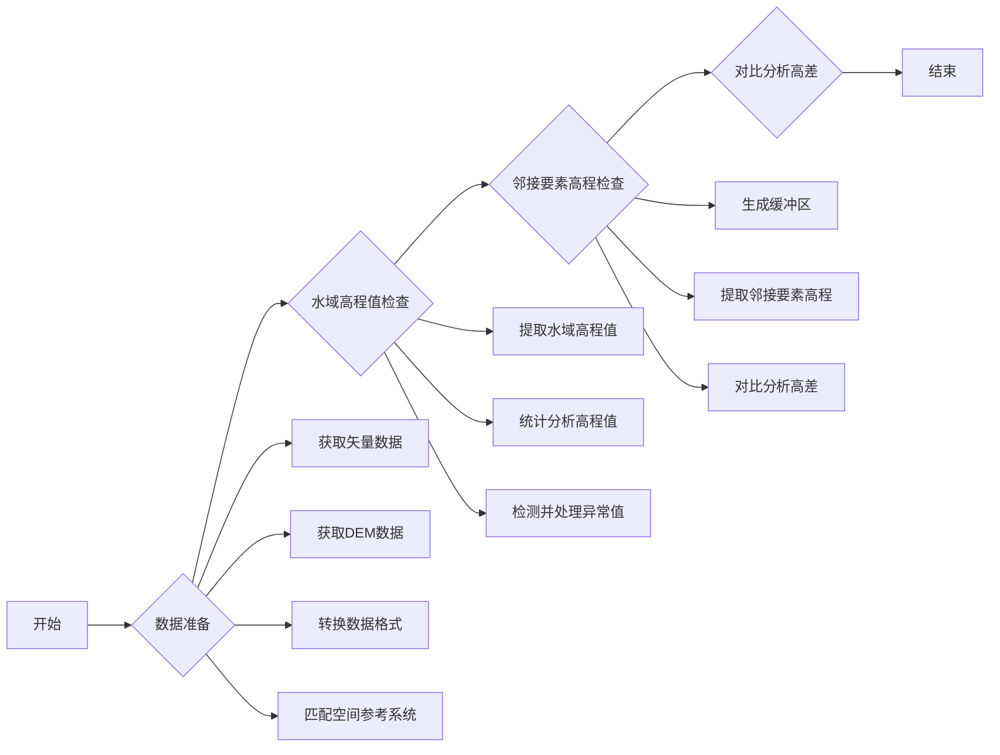

```mermaid
graph LR
    A[开始] --> B{数据准备}
    B --> C{水域高程值检查}
    C --> D{邻接要素高程检查}
    D --> E{对比分析高差}
    E --> F[结束]

    B --> B1[获取矢量数据]
    B --> B2[获取DEM数据]
    B --> B3[转换数据格式]
    B --> B4[匹配空间参考系统]

    C --> C1[提取水域高程值]
    C --> C2[统计分析高程值]
    C --> C3[检测并处理异常值]

    D --> D1[生成缓冲区]
    D --> D2[提取邻接要素高程]
    D --> D3[对比分析高差]
```