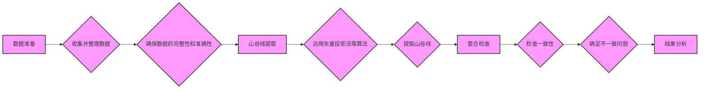

```mermaid
graph LR
    A[数据准备] --> B{收集并整理数据}
    B --> C{确保数据的完整性和准确性}
    C --> D[山谷线提取]
    D --> E{运用矢量投影法等算法}
    E --> F{提取山谷线}
    F --> G[套合检查]
    G --> H{检查一致性}
    H --> I{确定不一致问题}
    I --> J[结果分析]

    style A fill:#f9f,stroke:#333,stroke-width:2px
    style B fill:#f9f,stroke:#333,stroke-width:2px
    style C fill:#f9f,stroke:#333,stroke-width:2px
    style D fill:#f9f,stroke:#333,stroke-width:2px
    style E fill:#f9f,stroke:#333,stroke-width:2px
    style F fill:#f9f,stroke:#333,stroke-width:2px
    style G fill:#f9f,stroke:#333,stroke-width:2px
    style H fill:#f9f,stroke:#333,stroke-width:2px
    style I fill:#f9f,stroke:#333,stroke-width:2px
    style J fill:#f9f,stroke:#333,stroke-width:2px
```