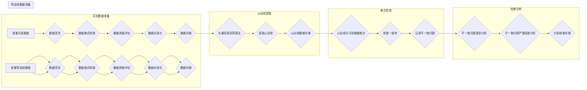

```mermaid
graph LR
    subgraph 河流数据准备
        A[收集河流数据] --> B{数据清洗}
        B --> C{数据格式转换}
        C --> D{数据质量评估}
        D --> E{数据标准化}
        E --> F{数据存储}
         G[收集等高线数据] --> H{数据清洗}
        H --> I{数据格式转换}
        I --> J{数据质量评估}
        J --> K{数据标准化}
        K --> L{数据存储}
    end
    
    subgraph 等高线数据准备
        G[收集等高线数据] --> H{数据清洗}
        H --> I{数据格式转换}
        I --> J{数据质量评估}
        J --> K{数据标准化}
        K --> L{数据存储}
    end

    subgraph 山谷线提取
        F --> M{矢量投影法等算法}
        M --> N{提取山谷线}
        N --> O{山谷线数据存储}
    end

    subgraph 套合检查
        O --> P{山谷线与河流数据套合}
        P --> Q{检查一致性}
        Q --> R{记录不一致问题}
    end

    subgraph 结果分析
        R --> S{不一致问题类型分析}
        S --> T{不一致问题严重程度分析}
        T --> U{分析结果存储}
    end

    subgraph 河流数据准备 [数据准备]
    end
    subgraph 等高线数据准备 [等高线数据准备]
    end
    subgraph 山谷线提取 [山谷线提取]
    end
    subgraph 套合检查 [套合检查]
    end
    subgraph 结果分析 [结果分析]
    end
```