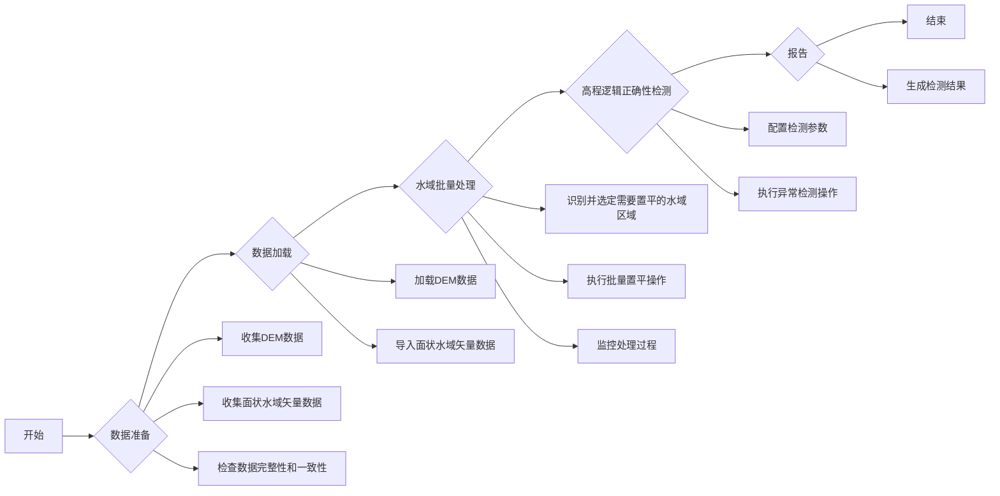

```mermaid
graph LR
    A[开始] --> B{数据准备}
    B --> C{数据加载}
    C --> D{水域批量处理}
    D --> E{高程逻辑正确性检测}
    E --> F{报告}
    F --> G[结束]

    B --> B1[收集DEM数据]
    B --> B2[收集面状水域矢量数据]
    B --> B3[检查数据完整性和一致性]

    C --> C1[加载DEM数据]
    C --> C2[导入面状水域矢量数据]

    D --> D1[识别并选定需要置平的水域区域]
    D --> D2[执行批量置平操作]
    D --> D3[监控处理过程]

    E --> E1[配置检测参数]
    E --> E2[执行异常检测操作]

    F --> F1[生成检测结果]
```