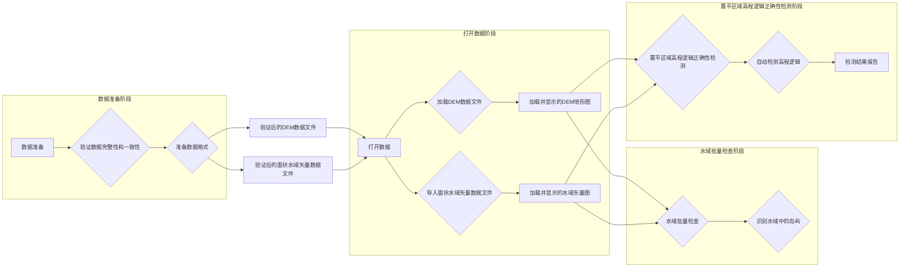

```mermaid
graph LR
    A[数据准备] --> B{验证数据完整性和一致性}
    B --> C{准备数据格式}
    C --> D[验证后的DEM数据文件]
    C --> E[验证后的面状水域矢量数据文件]

    D --> F[打开数据]
    E --> F
    F --> G{加载DEM数据文件}
    F --> H{导入面状水域矢量数据文件}
    G --> I[加载并显示的DEM地形图]
    H --> J[加载并显示的水域矢量图]

    I --> K{水域批量检查}
    J --> K
    K --> L{识别水域中的岛屿}

    I --> M{置平区域高程逻辑正确性检测}
    J --> M
    M --> N{自动检测高程逻辑}
    N --> O[检测结果报告]

    subgraph 数据准备阶段
        A
        B
        C
    end

    subgraph 打开数据阶段
        F
        G
        H
        I
        J
    end

    subgraph 水域批量检查阶段
        K
        L
    end

    subgraph 置平区域高程逻辑正确性检测阶段
        M
        N
        O
    end
```