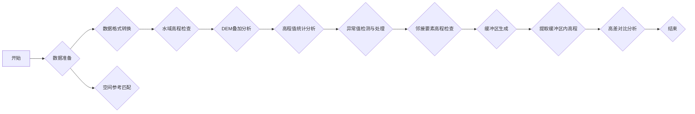

```mermaid
graph LR
    A[开始] --> B{数据准备}
    B --> C{数据格式转换}
    B --> D{空间参考匹配}
    C --> E{水域高程检查}
    E --> F{DEM叠加分析}
    F --> G{高程值统计分析}
    G --> H{异常值检测与处理}
    H --> I{邻接要素高程检查}
    I --> J{缓冲区生成}
    J --> K{提取缓冲区内高程}
    K --> L{高差对比分析}
    L --> M{结束}
```